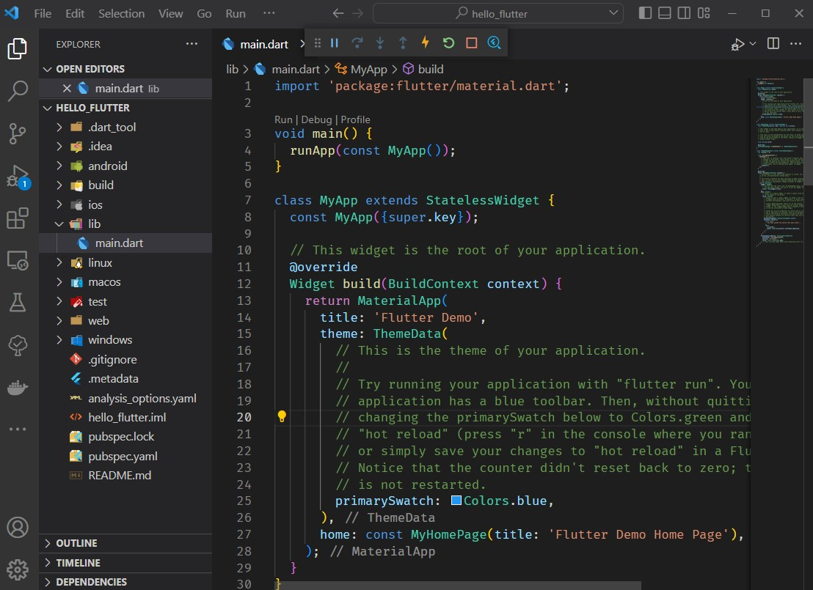
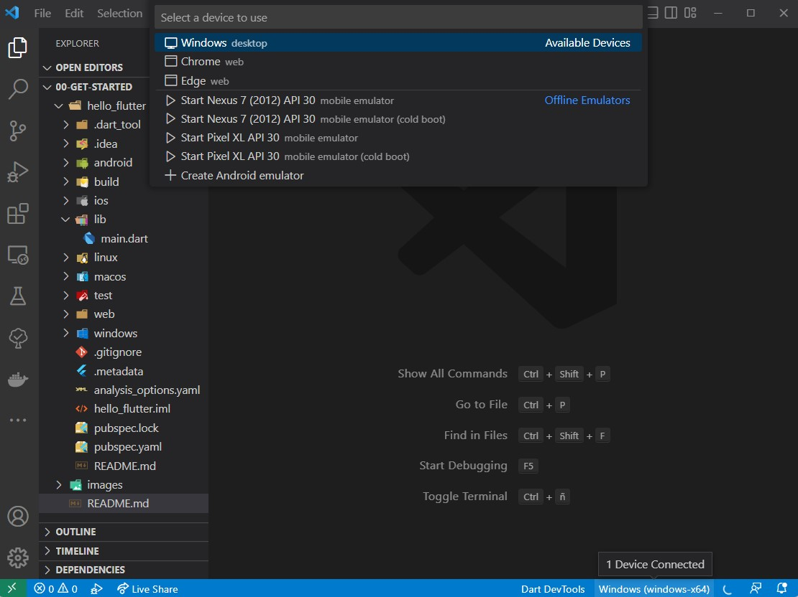

# Get Started

## Crear un nuevo proyecto

Vamos a crear un proyecto de Flutter. Para esto, desde VS Code:

- Abrimos desde el menú superior `View > Command Palette` (o pulsamos `F1`)
- Escribimos `Flutter: New Project`.
- Seleccionamos la carpeta donde queremos crear el proyecto.
- Le damos un nombre a nuestro proyecto. Por ejemplo, `hello_flutter`.
- Esperamos a que se cree el proyecto y se abrirá el fichero main.dart.

## Seleccionar y abrir un dispositivo

Desde la barra de estado de VS Code (la barra inferior azul), seleccionamos un dispositivo desde el area de `Device Selector`:

Podemos seleccionar un emulador de los que tengamos creados desde Android Studio AVD Manager, un dispositivo físico conectado por USB, o incluso lanzar la aplicación de Windows o en un navegador web.

## Ejecutar la aplicación

Con el fichero `main.dart` abierto, pulsamos `F5` o desde el menú superior `Run > Start Debugging` para ejecutar la aplicación.

Según el dispositivo que hayamos seleccionado, se abrirá la aplicación en el emulador, en el navegador web, en una aplicación Windows, o en el dispositivo físico:

# ¿Te apuntas a nuestro máster?

Si te ha gustado este ejemplo y tienes ganas de aprender Front End guiado por un grupo de profesionales ¿Por qué no te apuntas a nuestro [Máster Front End Online Lemoncode](https://lemoncode.net/master-frontend#inicio-banner)? Tenemos tanto edición de convocatoria con clases en vivo, como edición continua con mentorización, para que puedas ir a tu ritmo y aprender mucho.

Si lo que te gusta es el mundo del _backend_ también puedes apuntante a nuestro [Bootcamp backend online Lemoncode](https://lemoncode.net/bootcamp-backend#bootcamp-backend/inicio).

Y si tienes ganas de meterte una zambullida en el mundo _devops_ apuntate nuestro [Bootcamp devops online Lemoncode](https://lemoncode.net/bootcamp-devops#bootcamp-devops/inicio).
