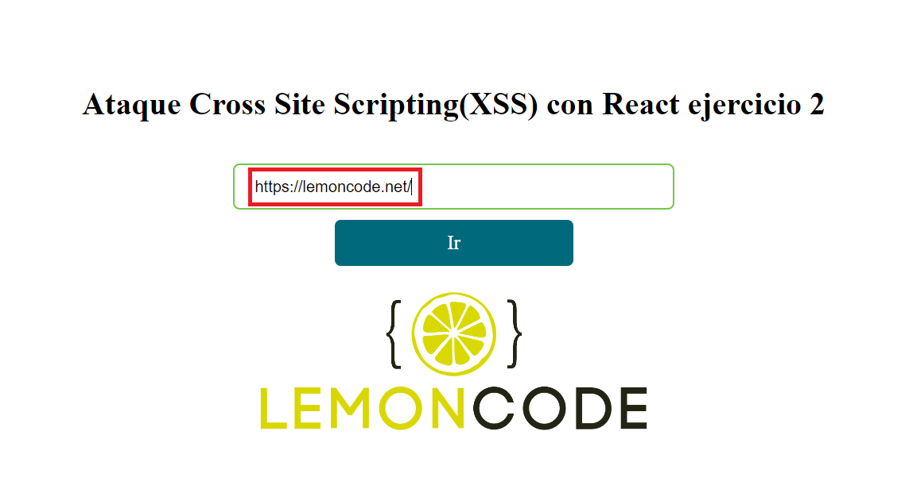
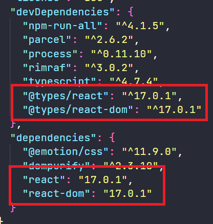

# XSS con React - Ejercicio 2 - href

En este ejemplo vamos a ver cómo se comporta React ante un ataque XSS en el que se inyecta código JavaScript en una etiqueta anchor.

Para ello vamos a tener un _input_ en el que vamos a poder escribir la URL a la que queremos navegar. Cuando pulsemos el botón de _Ir_ se nos navegará a la URL que hayamos escrito.

## Instalación

Vamos a ejecutar desde la línea de comandos `npm install` para instalar las dependencias que tenemos en nuestro _package.json_.

```bash
npm install
```

Una vez instaladas nuestras dependencias vamos a hacer `npm start` para arrancar nuestra aplicación.

```bash
npm start
```

Abrimos el navegador y vamos a la url:

[**http://localhost:1234**](http://localhost:1234)

> ## Pasos

Tenemos un _input_ donde vamos a introducir una dirección web. Cuando pulsemos el botón de _Ir_ nos navegará a la URL que hayamos escrito.

_./src/app.tsx_:

```tsx
......
    <input
      value={enlace}
      onChange={(e) => setEnlace(e.target.value)}
      className={classes.input}
    />

    <a href={enlace} className={classes.button}>
      Ir
    </a>
......
```

Vamos a empezar probando a la URL de lemoncode:

```text
https://lemoncode.net
```



Vemos que nos navega correctamente a la página de lemoncode.


Ahora vamos a probar a introducir una URL maliciosa:

```js
javascript: alert("la hemos liado");
```

Vemos que nos muestra un alert con el mensaje que hemos escrito.


Si ahora vemos nuestro archivo _package.json_



Vemos que tenemos _react_ y _react-dom_ en la versión 17.0.1, podemos pensar que esto es un problema de la versión de _react_ y que si actualizamos a la última versión esto ya no nos va a pasar.

Así que vamos a instalar la últmia versión de _react_, _react-dom_ y los typings:

```bash
npm install react@latest react-dom@latest
npm install -D @types/react@latest @types/react-dom@latest
```

Arrancamos la aplicación de nuevo:

```bash
npm start
```

Y probamos a introducir la URL maliciosa:

```js
javascript: alert("la hemos liado");
```

Y vemos que nos sigue mostrando el alert. Así que con la versión estable de _React_ nos sigue ocurriendo lo mismo. Podemos inyectar código malicioso en una etiqueta _anchor_.


## Cómo solucionarlo

Para solucionar esta vulnerabilidad necesitamos dos cosas:

- Usar `encodeURI` para codificar el input del usuario
- Usar una expresión regular para validar el input codificado

A continuación, actualizamos _app.tsx_:

```diff
import React from "react";
import logo from "./content/logo_2.png";
import * as classes from "./app.styles";

export const App: React.FC = () => {
  const [enlace, setEnlace] = React.useState("");

  return (
    <div className={classes.root}>
      <h1>Ataque Cross Site Scripting(XSS) con React ejercicio 2</h1>
      <div className={classes.formContainer}>
        <label htmlFor="enlace" className={classes.label}>Introduzca un enlace:</label>
        <input
          value={enlace}
          name="enlace"
-         onChange={(e) => setEnlace(e.target.value)}
+         onChange={(e) => {
+           const encoded = encodeURI(e.target.value);
+           const urlPattern = 
+             /^https?:\/\/(?:www\.)?[-a-zA-Z0-9@:%._\+~#=]{1,256}\.[a-zA-Z0-9()]{1,6}\b(?:[-a-zA-Z0-9()@:%_\+.~#?&\/=]*)$/;
+           if (urlPattern.test(encoded) || encoded === "") {
+             setEnlace(encoded);
+           } else {
+             setEnlace("https://www.google.es/");
+           }
+         }}
          className={classes.input}
        />

        <a href={enlace} className={classes.button}>
          Ir al enlace
        </a>
      </div>
      
    </div>
  );
};
```

Ahora, al probar de nuevo veremos que si introduciumos una URL no válida, automáticamente el campo se setea con el valor _"https://www.google.es/"_
