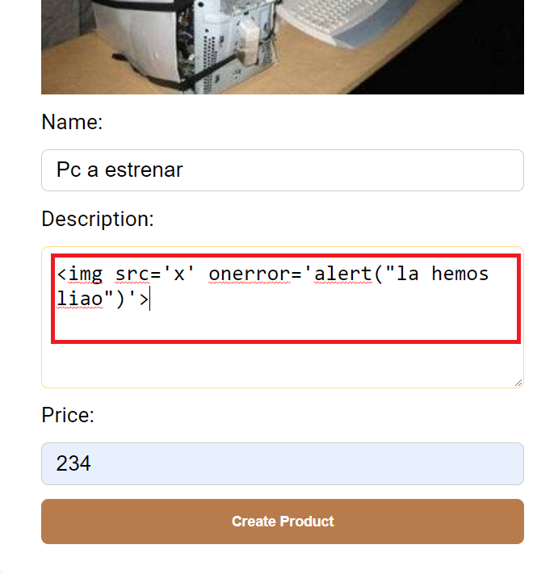
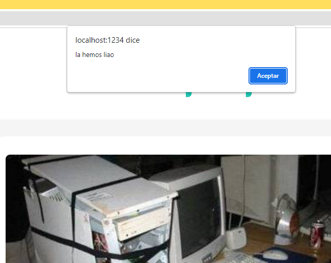

# XSS con React - Ejercicio 3 - Ualapop

En el siguiente ejemplo vamos a ver como se puede explotar una vulnerabilidad XSS en una aplicación React. Para ello vamos a insertar un código en el campo de descripción cuando creemos un nuevo producto. Este código va a ser un script que va a hacer que se muestre un mensaje de alerta cuando visitemos ese producto.

## Instalación

Vamos a ejecutar desde la línea de comandos `npm install` para instalar las dependencias que tenemos en nuestro _package.json_.

```bash
npm install
```

Una vez instaladas nuestras dependencias vamos a hacer `npm start` para arrancar nuestra aplicación.

```bash
npm start
```

Abrimos el navegador y vamos a la url:

[**http://localhost:1234**](http://localhost:1234)

## Pasos

Creamos un nuevo producto:


y en el campo descripción insertamos el siguiente código:

```html

```

Nos quedaría de la siguiente forma:



Creamos el producto y nos vamos a la lista de productos:


Al hacer click en el producto que hemos creado nos saldrá el siguiente mensaje de alerta:



El error que hemos cometido es que cuando hemos reenderizado el componente de descripción no hemos sanitizado el contenido que nos llega del servidor. Hemos usado el método `dangerouslySetInnerHTML` que nos permite insertar código html en el componente.

_src/pods/product/product.component.tsx_:

```javascript
<p dangerouslySetInnerHTML={{__html: product.description}}></p>
```

## Cómo solucionarlo

Para solucionar este problema podríamos hacer lo mismo que hemos hecho en el ejercicio anterior, es decir, usar la librería **DOMPurify** para sanitizar el contenido que nos llega del servidor.

Instalamos la librería

```bash
npm install dompurify
npm install -D @types/dompurify
```

Importamos la librería en el componente de descripción, y usamos el método **`sanitize`** para sanitizar el contenido que nos llega del servidor.

_src/pods/product/product.component.tsx_:

```diff
import React from "react";
+ import DOMPurify from 'dompurify';
.....
export const Product: React.FC<Props> = (props) => {
  const { product } = props;
+ const sanitizer = DOMPurify.sanitize;  
  return (
.....
- <p dangerouslySetInnerHTML={{__html: product.description}}></p>
+ <p dangerouslySetInnerHTML={{__html: sanitizer(product.description)}}></p>
.....
  );
};
```
