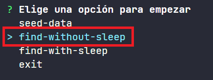

# NoSQL injection

Las bases de datos NoSQL se diferencian de las bases de datos SQL tradicionales en que almacenan los datos en un formato distinto al de las tablas. Esto las hace más flexibles y escalables, pero también las hace más vulnerables a los _injection attacks_.

En este ejemplo aprenderemos a explotar vulnerabilidades de este tipo.

## Requisitos

- Tener instalado [Docker](https://www.docker.com/products/docker-desktop)
- Tener instalado [MongoDB Compass](https://www.mongodb.com/try/download/compass)

## Instalación

Instalamos las dependencias:

```bash
npm install
```

## Pasos

Si ya tenemos un contenedor con mongo instanciado en el puerto por defecto, vamos a pararlo ya que vamos a usar el de pruebas que creamos aquí.

Arrancamos nuestra aplicación con `npm start`.

```bash
npm start
```

Se creará el contenedor de docker con mongo instalado. Ejecutar `docker ps` para comprobar


Y aparecerá un menú de opciones en nuestra consola, vamos a empezar añadiendo datos a nuestra base de datos para esto seleccionamos _seed-data_.


Una vez que se han añadido los datos a la base de datos, podemos verlos en _MongoDB Compass_. Creamos una nueva conexión con el siguiente connection string: _mongodb://localhost:27017_ y vemos que ha creado una base de datos llamada _test-database_ y una colección users que contiene datos de usuarios.


Vamos a tener una aplicación vulnerable donde hemos utilizado el operador de consulta _$where_ de MongoDB para filtrar los usuarios por su nombre. En este caso en particular vamos a buscar el usuario _Juan Pérez_.

_04-mongo-NOSQL-injection\helpers/find-without-sleep.runner.ts_:

```js
.....
const search = "Juan Pérez";

  const user = await dbInstance.collection("users").findOne({
    $where: function () {
      return this.name == search;
    },
  });
.....
```

Para esto vamos a seleccionar la opción _find-without-sleep_ en nuestro menú de opciones.



Y vemos que nos devuelve el usuario _Juan Pérez_.


Ahora vamos a ver como podemos explotar esta vulnerabilidad. Para esto vamos a utilizar el método [_sleep()_](https://www.mongodb.com/docs/manual/reference/method/sleep/) de MongoDB para que la consulta tarde más de lo normal.

_04-mongo-NOSQL-injection\helpers/find-with-sleep.runner.ts_:

```js
.....
const filter = "'Juan Pérez';sleep(5000)";
  const fn =
    "function () { const search =" + filter + ";return this.name == search;}";

  const user = await dbInstance.collection("users").findOne({
    $where: fn,
  });
.....
```

Si ahora ejecutamos _find-with-sleep_ en nuestro menú de opciones, vemos que tarda más de 5 segundos en devolvernos el usuario _Juan Pérez_. Y vemos la vulnerabilidad de NoSQL Injection con una cadena de texto.


